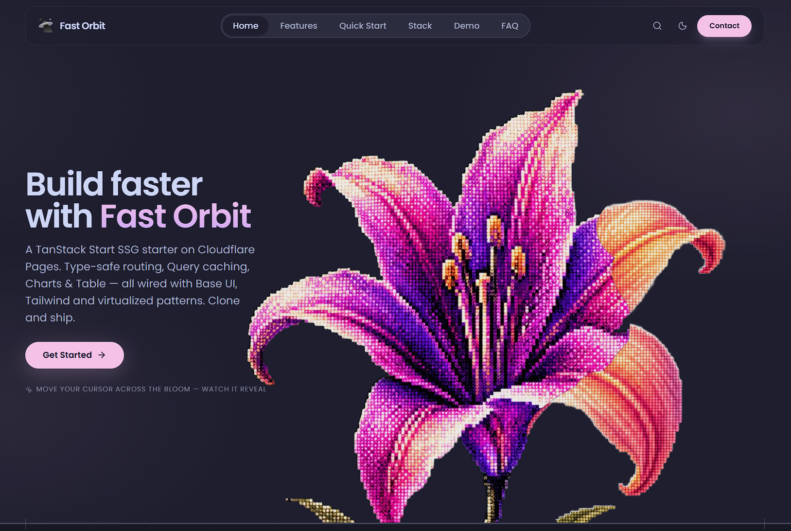

# Fast Orbit

Live demo: **https://fastorbit.danread.gq** — prerendered on Cloudflare Pages, hydrated on the client.



A TanStack Start starter that ships as static HTML from Cloudflare Pages. Type-safe routing, cached server state, charts, tables and virtualized lists — all wired with Base UI and Tailwind. Clone it and start building.

## What you get

Routing is file-based and type-safe with validation and intent preload. The build uses TanStack Start SSG; `crawlLinks` writes every route to `dist/` for Pages. Server state goes through TanStack Query with Zod and `keepPreviousData` so skeletons keep their size. Tables sort headlessly, lists virtualize with a windowed combobox, charts render line and dot marks and hotkeys cover Mod+K. Primitives come from Base UI (Dialog, Combobox, Select) in shadcn style without Radix. Styling is Tailwind v4 with `@theme` tokens and Catppuccin pink for `--primary` (#ea76cb on light, #f5c2e7 on dark). Icons are Lucide, fonts are self-hosted Poppins with a metric fallback, and security and quality come from CSP and `_redirects`, axe-core checks, and the Rust tools oxlint, oxfmt and the react-doctor plugin plus Fallow.

## Requirements

- Node 20+
- pnpm 10

## Tooling

**Build and bundle:** Vite 8 with Rolldown (`minify: oxc`, `target: esnext`, `cssCodeSplit: true`). `rolldownOptions.output` writes `assets/[name]-[hash].js` and `assets/[name][extname]` for CSS, splits `vendor-react`, `vendor-tanstack`, `vendor-ui-core`, `vendor-sonner`, `vendor-fuse`, `vendor-utils`, `vendor-charts` and `vendor-themes` via `manualChunks`. `rollup-plugin-visualizer` writes `bundle-analysis-client.html`. `vite build` does the client + SSG build, then TanStack Start prerenders with `crawlLinks` + hash filter to `dist/client`.

**Types and styles:** TypeScript 7 with `tsc -b`, Tailwind CSS v4 through `@tailwindcss/vite` and `@theme` in `src/styles/index.css`. Catppuccin pink drives `--primary` and `--ring`, surface tiers live in the same file. No `any` — strict.

**Lint and format (Rust):** `oxlint` (with `eslint-plugin-better-tailwindcss`, `eslint-plugin-react-hooks`, `eslint-plugin-react-refresh` and `eslint-plugin-react-doctor`) and `oxfmt`. Both run on Rust via `oxc`, so they are fast enough to keep on save. Config lives in `.oxlintrc.json` and `.oxfmtrc.json`.

**React Doctor:** The `react-doctor` OX plugin flags hydration and perf footguns — `new Date()` in render, `crypto.randomUUID()` in initial state, `useEffect(setState)` cascades, missing `aria-label`, `blur-2xl` and `transition-all`. See `.oxlintrc.json` for the full list.

**Testing:** Vitest 4 (`jsdom`, `globals`, `css: true`) for unit tests in `tests/unit` plus `@testing-library/react` and `jest-dom`. Playwright 1.62 + `@axe-core/playwright` for e2e and a11y on the prerendered HTML. `pnpm test` now runs `vitest run && playwright test` so a single command covers the whole suite; `pnpm test:unit` and `pnpm test:e2e` still work alone.

**UI:** Base UI 1.7 as the primitive layer (`Dialog`, `Combobox`, `Select`, `Tooltip` etc) styled with shadcn patterns. No Radix. Add a new primitive with `pnpm dlx shadcn@latest add <name> --yes` then rewire `@radix-ui/*` to `@base-ui/react/*`. Lucide React for icons.

**Quality:** Fallow 3.18 (`fallow.toml` with `ignorePatterns`, `ignoreDependencies`, `regression.baseline`). `npx fallow audit --format json --quiet` is the gate (0 clean, 1 findings, 2 error).

## Quick start

```bash
git clone https://github.com/Double77x/fastorbit-vite.git
cd fastorbit-vite
pnpm install
pnpm dev        # http://localhost:8080
pnpm build      # prerenders to dist/
pnpm preview    # wrangler pages dev --port 8788
```

`pnpm dev` starts the Vite dev server with HMR. `pnpm build` runs `vite build && tsc -b` and crawls links to emit static HTML for every route, including `/#quick-start`, `/#stack` and `/#weather` hashes.

## For agents

This repo is set up to be read top-down by an agent. Start here:

1. `docs/ARCHITECTURE.md` — system design, routing and SSG lifecycle
2. `docs/TECH_STACK.md` — exact versions and why each piece was chosen
3. `docs/CODING_STANDARDS.md` — state rules (Query for server state, Router for URL state), no `useEffect` fetch, composition over inheritance
4. `docs/STYLE_GUIDE.md` — Tailwind tokens and layout zones
5. `src/components/landing/StackSection.tsx` — live version badges from `package.json`
6. `src/data/locations.ts` + `src/lib/weather-api.ts` + `src/hooks/use-weather.ts` — example Query + Zod flow
7. `src/components/weather/` — Query, Charts, Table and Virtual wired together, URL param `?location=` via `validateSearch`

Quality gates before you open a PR:

```bash
pnpm lint                 # oxlint
pnpm format               # oxfmt
npx tsc -b --noEmit       # typecheck
pnpm build                # must prerender 13 pages, no Base UI #24
npx fallow audit --format json --quiet 2>/dev/null
# 0 = clean, 1 = findings, 2 = error envelope
pnpm test:unit            # vitest
pnpm test                 # playwright + axe
```

`fallow.toml` holds the baseline for `dead-code`, `dupes` and `health`. Use `fallow dead-code --trace src/file:export` before deleting a flagged export — Tailwind and oxlint plugins are false positives. See `docs/CODING_STANDARDS.md#15`.

React Doctor runs as an oxlint plugin (`eslint-plugin-react-doctor`). It flags hydration mismatches (`new Date()` in render, `randomUUID` in initial state, `useEffect(setState)`), missing labels, and large blur animations. Check `.oxlintrc.json` for the active rules.

## Project structure

```
src/
  components/
    landing/   HeroSection (flower morph trail), FeaturesSection, QuickStartSection, StackSection, FaqSection
    weather/   WeatherSection (Query+Charts+Table), LocationPicker (virtualized Combobox), WeatherChart, WeatherTable
    layout/    Grid, layout-variants, LegalLayout, Prose
    ui/        Base UI primitives (button, card, badge, dialog, combobox)
  data/        locations (20 cities), navigation (single source for nav + palette), legal, faqs
  hooks/       use-weather (useQuery + keepPreviousData), use-navbar-scroll, use-element-size
  lib/         weather-api (Zod, fetch), query-client, site, utils, virtualization
  pages/       Home, legal pages, Changelog (0.1.0)
  routes/      __root (head + fonts), index (validateSearch for ?location)
  styles/      index.css (@theme tokens), fonts.css
public/
  _headers     CSP (allows api.open-meteo.com + higgs images), cache for /assets
  _redirects   SPA fallback for unknown routes
  sitemap.xml  generated via scripts/generate-sitemap.js
scripts/
  generate-sitemap.js      route discovery → public/sitemap.xml
  append-html-headers.js   postbuild: per-route HTML no-cache → dist/client/_headers
```

## Deploy

Cloudflare Pages serves `dist/client` (`pages_build_output_dir` in `wrangler.toml`):

```bash
pnpm build
wrangler pages deploy dist/client
```

`pnpm build` runs `vite build && tsc -b`, then `postbuild` chains two scripts:

```bash
node scripts/generate-sitemap.js && node scripts/append-html-headers.js
```

### Caching strategy

- **Prerendered HTML** (`/`, `/legal/*`, `/404`): `public, max-age=0, must-revalidate`. Every navigation revalidates (cheap `304` when unchanged), so deploys show instantly instead of sitting in browser cache.
- **Hashed JS** (`/assets/*.js`), **fonts**, **images**: 1-year `immutable`. Content hashes change on every code change, so long caching is safe.
- **CSS** (`/assets/*.css`): `must-revalidate` — emitted without a content hash (deterministic naming avoids Client/SSR divergence), so it must revalidate like HTML.

This stays highly performant: the SSG HTML files are tiny (~35–92KB) while the large TS/JS bundles keep 1-year immutable caching. Only the small shell revalidates; the heavy assets come from cache.

### Why a postbuild script for HTML headers?

Cloudflare Pages `_headers` rules match the **request path**, not the file on disk. A prerendered `legal/terms.html` is served at the clean URL `/legal/terms`, so a `/*.html` rule would never match what browsers actually request — each route needs its own explicit entry. Routes are only known after the SSG crawl, so `scripts/append-html-headers.js` scans `dist/client/**/*.html`, maps each file to its clean route (`index.html` → `/`, `legal/terms.html` → `/legal/terms`, `404.html` → `/404`), and appends an idempotent marked block to the built `dist/client/_headers` (the Vite copy of `public/_headers`). Never hand-edit the generated block — edit `public/_headers` or the script instead. Covered by `tests/unit/scripts/append-html-headers.test.ts`.

## Docs

- `docs/ARCHITECTURE.md` — routing, SSG, data flow, design system
- `docs/TECH_STACK.md` — versions and rationale
- `docs/CODING_STANDARDS.md` — hooks, state, perf, a11y, Fallow
- `docs/STYLE_GUIDE.md` — tokens and layout
- `docs/migration/TANSTACK_START_SSG.md` — SPA → Start SSG steps

## Contributing

We welcome issues and pull requests. This is a starter — keep changes small, typed and lint-clean.

### Issues

Use the Bug report template for bugs and include steps to reproduce, what you expected, what happened, the browser, and a short `pnpm build` log if prerender failed. For features, use the Feature request template and describe the use case first; for larger work open an issue before you start so we do not pull in different directions. For questions, check `docs/ARCHITECTURE.md` and `docs/CODING_STANDARDS.md`, then try GitHub Discussions or `CTRL+K` → Contact.

### Pull requests

1. Fork and branch from `main` — for example `git checkout -b feat/short-name`.
2. Keep the gates green:

   ```bash
   pnpm lint
   pnpm format
   npx tsc -b --noEmit
   pnpm build
   npx fallow audit --format json --quiet 2>/dev/null
   pnpm test:unit
   ```

3. Add tests for new hooks or anything in `src/lib`. Pure functions are the easiest to cover. If you add a stack item, update `src/components/landing/StackSection.tsx` so its badge stays in sync.
4. Update docs when you touch architecture, tokens or routing, and keep `AGENTS.md` aligned.
5. Push and open a PR against `main`. Describe what changed and why, how you tested it, and add screenshots for UI work. Link the issue if there is one.

We use [Conventional Commits](https://www.conventionalcommits.org/) (`feat:`, `fix:` …) so the changelog and `fallow` health stay readable. Keep reviews focused on the code and be kind. See `CODE_OF_CONDUCT.md` if it exists.

### Security

Email `danreaduk@proton.me` for security issues rather than opening a public issue. The current CSP lives in `public/_headers` and the policy page is `src/pages/Security.tsx`.

## License

MIT © Dan Read — [@Double77x](https://github.com/Double77x)

See [LICENSE](./LICENSE) for details. Fast Orbit is free to clone, fork and ship. If you build something, a link back is appreciated but not required.
